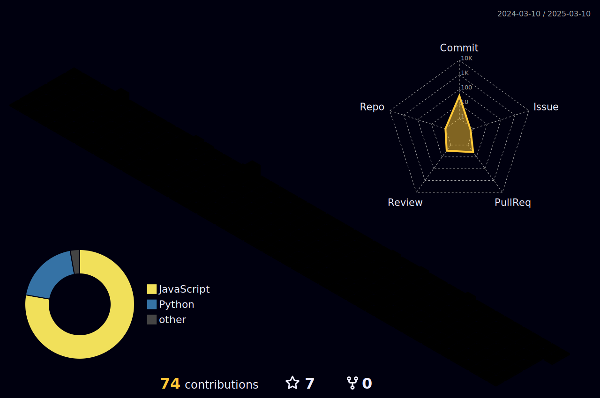

# :mage_woman: Primary Spells

### :sparkles: [projectEMI](https://github.com/allforest01/projectEMI)
A script designed to automate the process of placing orders for product on [shopee.vn](https://shopee.vn/).

### :sparkles: [Noz3nogram](https://github.com/allforest01/Noz3nogram)
An automation tool for solving [Picross Touch](https://store.steampowered.com/app/476460/Picross_Touch/)'s challenges.

### :sparkles: [HypnosisMagic](https://github.com/allforest01/HypnosisMagic)
Simple cross-platform remote desktop tool in LAN.

### :sparkles: [Gomoku](https://github.com/allforest01/Gomoku)
A two-player Caro game using Pygame and Pygame-GUI with cross-platform compatibility.

# :mage_woman: Magic Arrays

